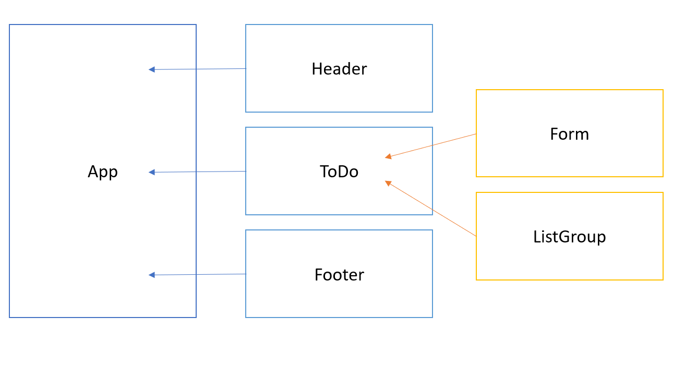

# LAB - Class 31

## Project: To Do app

### Author: Dina Ayoub

### Links and Resources

- [ci/cd](https://github.com/Dina-401-Advanced-Javascript/todo/actions) (GitHub Actions)
- [back-end server url on heroku](https://dina-todo.herokuapp.com/)

### Setup

#### How to initialize/run your application (where applicable)

- `npm start`

#### How to use this app

- you can add to do list items by using the form on the left. Enter a task, person's name to assign it to, a due date, and a difficulty, then click submit.
- you can check off items from the list by clicking on them.

#### Tests (not currently working)

- `npm test`
- Tests will check:
  - Can load the page with the initial set of to do items
  - Can submit a to do item and find it in the list

#### UML

